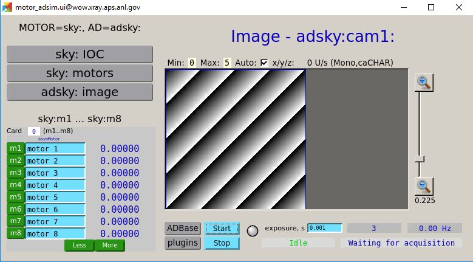

# README

A few brief notes about starting the caQtDM GUI at APS.

## (re)start the IOCs

```
start_xxx.sh sky
start_adsim.sh adsky
```

## common configuration for caQtDM GUI

```
DOCKERS=/tmp/docker_ioc
export CAQTDM_DISPLAY_PATH=${CAQTDM_DISPLAY_PATH}:${DOCKERS}/iocsky/xxx-R6-1/xxxApp/op/ui
export CAQTDM_DISPLAY_PATH=${CAQTDM_DISPLAY_PATH}:${DOCKERS}/iocadsky/iocSimDetector
export CAQTDM_DISPLAY_PATH=${CAQTDM_DISPLAY_PATH}:${DOCKERS}/synapps-6.1/screens/ui
export CAQTDM_DISPLAY_PATH=${CAQTDM_DISPLAY_PATH}:${DOCKERS}/synapps-6.1-ad-3.7/screens/ui
```

Also, while at APS: `export PATH=${PATH}:/APSshare/bin`

## start the GUI

pick one of these to start a GUI

```
run_designer &
caQtDM -macro "P=sky:" xxx.ui &
caQtDM -macro "P=adsky:,R=cam1:" ad_cam_image.ui  &
caQtDM -macro "MOTOR=sky:,AD=adsky:" motor_adsim.ui  &
```

This last command should start a view like this:


CAUTION!!! 
Watch out for the `Less` and `More` buttons at the bottom of the motor controls.
They come from the `topMotors8_more.ui` file and will cause
this screen to be deleted and replaced with the next screen.
No coming back from that.
