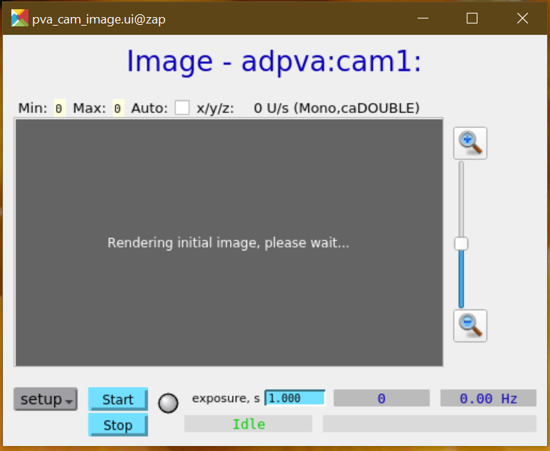

<!--lint disable list-item-indent -->
<!--lint disable no-undefined-references -->

# Area Detector IOC using pvaDriver

The BDP (beamline data pipelines) project wants to inject real data into the
data acquisition pipeline as part of the trial demonstration.  EPICS area
detector has a [pvaDriver](https://github.com/areaDetector/pvaDriver)
([documentation](https://areadetector.github.io/master/pvaDriver/pvaDriver.html))
that monitors an [EPICS
PVAccess](https://epics-controls.org/resources-and-support/documents/pvaccess/)
(PVA) PV for new data to be pushed through the area detector pipeline.

Here, an IOC using the `pvaDriver` is provided using the [`custom-synapps-6.2-ad-3.10`](https://hub.docker.com/repository/docker/prjemian/custom-synapps-6.2-ad-3.10) 
docker image.

- [Area Detector IOC using pvaDriver](#area-detector-ioc-using-pvadriver)
  - [Usage](#usage)
    - [Example](#example)
    - [Graphical User Interface](#graphical-user-interface)
  - [Original Proposal](#original-proposal)
    - [Questions](#questions)
    - [Requirements](#requirements)

## Usage

1. Download the the `start_adpva.sh` IOC starter (a bash shell script)

2. Give the starter exectuable permissions: `chmod +x start_adpva.sh`

3. Move `start_adpva.sh` to a folder on your executable `PATH`, such as `~/bin/`.

4. Start the IOC:
   1. `start_adpva.sh` (use default IOC prefix `13PVA1`)
   2. `start_adpva.sh adpva` to use custom IOC prefix `adpva`

5. Copy the GUI starter (a bash shell script) from the IOC folder to your
   executable folder.  See the [Graphical User
   Interface](#graphical-user-interface) section below.

### Example

Start IOC with default prefix (`13PVA1`):

```bash
user@localhost$ ~/bin/start_adpva.sh 
starting container ioc13PVA1 ... 833690c4318e7231705fd45fbe63c54daacd5332c2c42d0c43a6534373eeb65c
starting IOC ioc13PVA1 ... Starting adpva
changing 13PVA1: to 13PVA1: in ./start_caQtDM_13PVA1
copy IOC ioc13PVA1 files to /tmp/docker_ioc/ioc13PVA1
```

Start IOC with custom prefix (`adpva`):

```bash
user@localhost$ ~/bin/start_adpva.sh adpva
starting container iocadpva ... 472bda079561f6ec6e1fe16b1d9f689b026e83113583ca400bef4d6af213226c
starting IOC iocadpva ... Starting adpva
changing 13PVA1: to adpva: in ./start_caQtDM_adpva
copy IOC iocadpva files to /tmp/docker_ioc/iocadpva
```

Test that IOC is running by accessing a couple PVs using the IOC's prefix.  Using `adpva` as the IOC prefix in these examples.

Connect with EPICS ChannelAccess (CA) PVs (the detector state and whether the IOC is connected with a PVA data source):

```bash
user@localhost$ caget adpva:cam1:DetectorState_RBV
adpva:cam1:DetectorState_RBV   Idle
(bluesky_2022_1) prjemian@zap:~/Documents/2022-03-01-adpva$ caget adpva:cam1:PvConnection_RBV
adpva:cam1:PvConnection_RBV    Down
```

Show an EPICS PVAccess (PVA) PV (the name of the PVA data source):

```bash
user@localhost$ pvget adpva:cam1:PvName
adpva:cam1:PvName 2022-03-02 10:39:57.932  []
```

Show information about the PVA image (noting that to get an image from this PV, you will need to enable the PVA plugin, configure a PVA data source, starting Acquire on this IOC, and provide new updates from the PVA data source):

```bash
user@localhost$ pvinfo adpva:Pva1:Image
adpva:Pva1:Image
Server: 192.168.144.97:38741
Type:
    epics:nt/NTNDArray:1.0
        union value
            boolean[] booleanValue
            byte[] byteValue
            short[] shortValue
            int[] intValue
            long[] longValue
            ubyte[] ubyteValue
            ushort[] ushortValue
            uint[] uintValue
            ulong[] ulongValue
            float[] floatValue
            double[] doubleValue
        codec_t codec
            string name
            any parameters
        long compressedSize
        long uncompressedSize
        dimension_t[] dimension
            dimension_t
                int size
                int offset
                int fullSize
                int binning
                boolean reverse
        int uniqueId
        time_t dataTimeStamp
            long secondsPastEpoch
            int nanoseconds
            int userTag
        epics:nt/NTAttribute:1.0[] attribute
            epics:nt/NTAttribute:1.0
                string name
                any value
                string descriptor
                int sourceType
                string source
        string descriptor
        alarm_t alarm
            int severity
            int status
            string message
        time_t timeStamp
            long secondsPastEpoch
            int nanoseconds
            int userTag
        display_t display
            double limitLow
            double limitHigh
            string description
            string format
            string units
```

In this GUI, there is a checkbox to the right of the `Auto:` text to autoscale the image display.  To the right of this control is a report of the number of display image updates per second (`0 U/s` as shown).  The frame rate of images (from the IOC's Image plugin) is shown below the image.  (Is the exposure time relevant for this IOC?)

### Graphical User Interface

Here, the [caQtDM](https://caqtdm.github.io/) application is used to demonstrate operation of the IOC.  Using `adpva` as the IOC prefix in this example.

You will need the `caQtDM` executable on your `PATH`.  Start the GUI for the `adpva` IOC:

```bash
/tmp/docker_ioc/iocadpva/iocpva/start_caQtDM_adpva
```

This is a view of the GUI for an IOC that was just started:



The *setup* (pop-up menu) button provides access to `ADPvaDriver` (main IOC controls), `ADBase` (generic IOC controls), and `plugins` (list of available area detector plugins).

To see an image, you must first *Enable* the image plugin from the `setup` -> `plugins` screen.

## Original Proposal

**Before** the support was created, we had some questions and requirements.

### Questions

The [epics-docker custom area detector 
image](https://github.com/prjemian/epics-docker/tree/main/v1.1/n6_custom_areaDetector) has `pvaDriver` already built.  (The 
[`custom-synapps-6.2-ad-3.10`](https://hub.docker.com/repository/docker/prjemian/custom-synapps-6.2-ad-3.10) 
docker image has it.  How about the 
[`synapps-6.2-ad-3.10`](https://hub.docker.com/repository/docker/prjemian/synapps-6.2-ad-3.10) 
image? [Perhaps](https://github.com/prjemian/epics-docker/search?q=pvaDriver).)
It should be possible to start a new container with the `13PVA1:` IOC with a new bash shell script.

### Requirements

- [x] host shell script that creates new container and starts IOC
- [x] is custom IOC prefix supported by the image?  Yes, with some script editing.
- [x] shared volume between container & host
- [x] caQtDM starter and GUI screen
